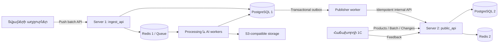

# Barcodes

## Նախագծի նկարագիր

**Barcodes**-ը Data as a Service համակարգ է, որը տարբեր աղբյուրներից ընդունում է ապրանքային տվյալներ, պահպանում դրանց սկզբնական տարբերակներն ու պատմությունը, AI-ի միջոցով ձևավորում է միասնական կանոնական ապրանք և այն տրամադրում հաճախորդների 1C բազաներին արագ API-ով։

**Ընթացիկ վիճակ․** W1–W6 փաթեթները պատրաստ են։ Առկա են idempotent ingest, durable AI pipeline, immutable canonical versions, non-blocking secure image processing, reliable Server 1 → Server 2 publication, tenant authentication, Redis-backed public product API և race-safe quota/usage accounting։ Հաջորդ քայլը W7 append-only feedback և cursor-based changes API-ն է։

Առաջին փուլի տեխնիկական աղբյուրը՝ [[Barcodes/DaaS_Barcodes_Phase1_Technical_Spec_AM.docx|DaaS Barcodes Phase 1 տեխնիկական պահանջ]]։

## Առաջին փուլի արդյունքը

MVP-ն պետք է ապահովի ամբողջական շղթան՝

1. source push API-ով batch ներմուծում,
2. raw payload-ների և source revision-ների անփոփոխ պահպանում,
3. տեխնիկական նորմալացում և վավերացում,
4. AI-ի միջոցով structured product տվյալների ստացում,
5. immutable canonical product version-ի ստեղծում,
6. transactional outbox-ով հրապարակում Server 2,
7. tenant-ների համար արագ product և batch API,
8. ամսական unique-barcode quota և օրական request limit,
9. append-only feedback intake և cursor-based changes API,
10. Docker-ով տեղակայում, metrics, backup և automated tests։

Մեկնարկային տարողությունը՝ **100,000 հրապարակված ապրանք**, հետագա հորիզոնական ընդլայնման հնարավորությամբ։

## Սահմաններ

### MVP-ի մեջ է

- Server 1 ingest API, batch lifecycle և idempotency։
- Source revisions, normalization, image processing և AI pipeline։
- Canonical product, versioning և reliable publication։
- Server 2 public read model, cache, quota և usage accounting։
- Feedback event-երի ընդունում և changes feed։
- Observability, security checks, backup/restore և automated testing։

### MVP-ի մեջ չէ

- Կենտրոնական Server 3 / 1C configuration։
- Feedback-ի ավտոմատ համադրում և վերահաստատում։
- Billing/payment և ավտոմատ հաշիվներ։
- Ամբողջական web admin panel։
- Հաճախորդի հարկային հաշվարկներ։
- Կշեռքի ներքին barcode-ների վերծանում։
- Չափման միավորների կամ վաճառքի գնի կառավարում։

## Ճարտարապետություն

Server 2-ը ինքնուրույն read model է և runtime կախվածություն չունի Server 1-ի հասանելիությունից։ Product արժեքների որոշումն ու version-ի աճը կատարվում են միայն Server 1-ում։

## Հիմնական public product contract

| Դաշտ | Տիպ | Հիմնական կանոն |
|---|---|---|
| `barcode` | string | GTIN-8/12/13/14, պահպանում է առաջատար զրոները |
| `name` | string | 1–255 նիշ |
| `image_url` | string/null | Վավերացված ապրանքի պատկեր |
| `atg_code` | string | Ճիշտ 4 թվանշան |
| `vat` | boolean | Միայն JSON `true`/`false` |
| `is_weighted` | boolean | Միայն JSON `true`/`false` |
| `category_id` | string | Կայուն taxonomy ID |
| `version` | integer | Barcode-ի մոնոտոն աճող տարբերակ |

## Տեխնոլոգիական հիմք

- Python 3.13
- FastAPI և Pydantic v2
- SQLAlchemy 2 և Alembic
- PostgreSQL 17+, առանձին DB յուրաքանչյուր սերվերի համար
- Celery + Redis կամ համարժեք queue adapter
- HTTPX
- S3-compatible object storage
- Docker Compose
- Prometheus metrics և structured JSON logs
- pytest, Ruff և mypy/pyright

## Իրականացման աշխատանքային փաթեթներ

| Փաթեթ | Արդյունք | Կախվածություն |
|---|---|---|
| W0 | Տեխնիկական որոշումներ և ամրագրված contracts | — |
| W1 | Monorepo skeleton, CI և local Compose | W0 |
| W2 | Server 1 ingest, sources, batches և validators | W1 |
| W3 | Normalization, AI pipeline և reprocess | W2 |
| W4 | Canonical product, images, versioning և outbox | W2–W3 |
| W5 | Server 2 products, batch, categories, auth և cache | W1 |
| W6 | Daily request limit, monthly unique barcode և usage reports | W5 |
| W7 | Append-only feedback և cursor-based changes API | W4–W6 |
| W8 | Load/failure/security tests, backup և production hardening | Բոլորը |

Մոտավոր տևողությունը երկու backend ծրագրավորողի և part-time DevOps-ի դեպքում՝ **10–12 շաբաթ**։

## Առաջին milestone

Առաջին ցուցադրելի արդյունքը պետք է լինի գործող ingest շղթա՝

- source key-ով authentication,
- batch-ի ընդունում և `202 Accepted`,
- request idempotency,
- raw revision persistence,
- GTIN/name/boolean/ATG validation,
- batch status,
- unit, contract և integration tests։

## MVP Definition of Done

- Նույն batch-ի replay-ը duplicate revision չի ստեղծում։
- AI-ի վավեր արդյունքը ստեղծում է product version և հասնում Server 2։
- Publication replay-ը duplicate change event չի ստեղծում։
- Public API-ն պահպանում է barcode-ի առաջատար զրոները։
- `vat` և `is_weighted` դաշտերը միշտ JSON boolean են։
- Monthly unique quota-ն race-safe է և նույն barcode-ը հաշվում է մեկ անգամ։
- Batch API-ն վերադարձնում է per-item partial success։
- Feedback-ը append-only և idempotent է։
- Changes cursor-ը պահպանում է հաստատուն հերթականություն։
- Server 1-ի կանգի ժամանակ Server 2-ը շարունակում է սպասարկել հրապարակված տվյալները։
- Redis-ի կանգի ժամանակ product read-ը fallback է անում PostgreSQL-ին։
- Backup restore-ը հաջողությամբ փորձարկված և փաստաթղթավորված է։

## Բաց որոշումներ

- [ ] Ընտրել AI provider-ը և սկզբնական model-ը։
- [ ] Հաստատել category taxonomy-ի առաջին տարբերակը։
- [ ] Ընտրել S3-compatible storage-ը։
- [x] Ընտրել HMAC-SHA256-ը որպես MVP internal sync authentication։
- [x] Ամրագրել UUIDv7-ը որպես ժամանակով դասավորվող identifier։
- [ ] Հաստատել hosting topology-ն և target RPS-ը։
- [x] Սահմանել source API key-ի high-entropy format-ը, `scrypt` hashing-ը, scopes-ը և revocation status-ը։
- [ ] Պատրաստել 300–500 ապրանքի gold dataset։

## Փաստաթղթերի քարտեզ

- [[Barcodes/README|GitHub-ի մուտքային էջ և repository կառուցվածք]]։
- [[Barcodes/docs/README|Փաստաթղթերի ինդեքս]]։
- [[Barcodes/docs/architecture/README|Ճարտարապետություն]]։
- [[Barcodes/docs/decisions/README|Architecture Decision Records]]։
- [[Barcodes/docs/api/README|API contracts]]։
- [[Barcodes/docs/runbooks/README|Օպերացիոն runbook-ներ]]։
