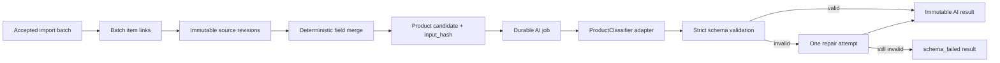

# W3 normalization and AI pipeline

W3-ը source revision-ներից ստեղծում է վերարտադրելի AI input, այն ուղարկում provider-neutral adapter-ին և պահպանում է raw ու validated արդյունքները՝ առանց պատմությունը վերագրելու։



## Ինչու երեք առանձին entity

- `product_candidates` — AI-ից առաջ ստացված normalized snapshot-ն է։ Նույն semantics-ը նույն `input_hash`-ն ունի։
- `ai_jobs` — provider batch-ի mutable lifecycle-ն է՝ pending, submitted, retry կամ completed։ Queue delivery-ի replay-ը նույն job-ն է գտնում request hash-ով։
- `ai_results` — immutable փորձի արդյունքն է։ Այն պահում է raw response-ը, parsed contract-ը, warnings-ը և usage metadata-ն։

Այս բաժանումը թույլ է տալիս փոխել prompt-ը կամ model-ը և կողք կողքի համեմատել արդյունքները՝ առանց նախորդ պատասխանը կորցնելու։

## Candidate merge rule

Յուրաքանչյուր canonical դաշտ ընտրվում է առանձին՝ այս հերթականությամբ․

1. source-ի տվյալ դաշտի փոքրագույն priority թիվ,
2. ամենաթարմ `source_updated_at`/revision time,
3. source և revision ID-ներով կայուն tie-break։

AI-ն չի որոշում, թե որ source payload-ն է մուտք դառնում։ Այդ որոշումը deterministic է, audit-able և unit test-ով ամրագրված։ Candidate-ը նաև պահում է յուրաքանչյուր ընտրված դաշտի source/revision origin-ը։

## Provider և retry policy

Business service-ը ճանաչում է միայն `ProductClassifier` interface-ը՝ submit, status, cancel և parse գործողություններով։ W3-ում առկա `deterministic` adapter-ը նախատեսված է միայն development/test միջավայրի համար և production-ում արգելված է։

- transient provider failure՝ առավելագույնը 3 Celery retry,
- exponential backoff + jitter,
- JSON/schema failure՝ մեկ repair submit,
- երկրորդ schema failure՝ immutable `schema_failed` result,
- barcode mismatch՝ schema failure, որովհետև AI-ն իրավունք չունի փոխել barcode-ը։

Batch-ը database-ում ընդունված է մինչև Redis dispatch-ը։ Եթե queue-ն ժամանակավորապես անհասանելի է, ingest-ը շարունակում է վերադարձնել `202`, իսկ accepted batch-ը կարելի է անվտանգ նորից enqueue անել։

Recovery-ն սկզբում dry-run է՝

```powershell
docker compose run --rm worker python scripts/recover_processing.py
docker compose run --rm worker python scripts/recover_processing.py --apply
```

## Prompt versions և reprocess

Prompt text-երը գտնվում են source-controlled registry-ում՝ `packages/domain/prompts.py`։ Reprocess-ը պահանջում է explicit selector և deployed prompt version։ Նույն candidate/provider/model/prompt համադրությունը երկրորդ անգամ չի մշակվում։ Նոր prompt/model-ը ստեղծում է նոր job և նոր result՝ հինը չփոխելով։

```powershell
docker compose run --rm worker python scripts/reprocess.py `
  --failed-only `
  --prompt-version product-v2
```

Ամբողջ բազայի reprocess-ը նույնպես explicit է և ունի limit՝

```powershell
docker compose run --rm worker python scripts/reprocess.py `
  --all `
  --prompt-version product-v2 `
  --limit 1000
```

## Հաջորդ ընդլայնումը

Իրական provider adapter ավելացնելիս պետք է՝

- provider SDK-ն պահել միայն `packages/ai_providers`-ում,
- API key-ը ստանալ secret environment/store-ից,
- provider batch ID-ն պահել մինչև polling-ը,
- ամբողջ prompt-ը production log-ում չգրել,
- gold dataset-ով համեմատել նոր model/prompt-ը deterministic contract tests-ից բացի։

Image download/WebP/object-storage հոսքը միտումնավոր այս slice-ում չէ. տեխնիկական work-package աղյուսակում այն canonical/image W4-ի մասն է։
