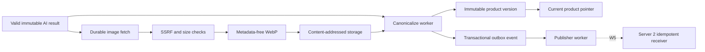

# W4 canonical product, images և reliable publication

W4-ը AI-ի վավեր արդյունքը վերածում է հրապարակելի ապրանքի, պահպանում է յուրաքանչյուր փոփոխության պատմությունը և Server 2 ուղարկվելիք event-ը ստեղծում է տվյալների նույն transaction-ում։



## Ինչու է canonical product-ը բաժանված երկու table-ի

- `canonical_products`-ը փոքր mutable projection է՝ barcode և ընթացիկ version։ Այն lock անելով նույն barcode-ի զուգահեռ update-ները հերթագրվում են։
- `product_versions`-ը immutable պատմությունն է՝ ամբողջ payload, content hash, փոխված դաշտերի `old/new` diff և origin։

Եթե incoming publishable fields-ի hash-ը նույնն է, function-ը վերադարձնում է ընթացիկ version-ը և ոչ version, ոչ event չի ավելացնում։ Եթե գոնե մեկ դաշտ փոխվել է, version-ը աճում է մեկով։ Նախկին վիճակին վերադառնալը նույնպես նոր version է, քանի որ համեմատությունը կատարվում է միայն ընթացիկ snapshot-ի հետ։

## Transaction սահմանը

Մեկ PostgreSQL transaction-ը կատարում է հետևյալը․

1. idempotent ձևով ստեղծում կամ գտնում է barcode-ի current row-ը,
2. վերցնում է `FOR UPDATE` lock,
3. համեմատում է ընթացիկ content hash-ը,
4. ստեղծում է immutable version-ը,
5. թարմացնում է current pointer-ը,
6. ստեղծում է նույն version-ի `product.upserted` outbox event-ը։

Այս պատճառով հնարավոր չէ ունենալ հրապարակման event առանց համապատասխան product version-ի կամ version առանց event-ի։ Publisher-ը network request-ի ընթացքում database lock չի պահում։ Crash-ի դեպքում նույն `event_id`-ն կրկին ուղարկվում է, իսկ W5-ի Server 2 receiver-ը այն պետք է deduplicate անի։

## Պատկերը ինչու է առանձին հոսք

Ապրանքը կարող է հրապարակվել `image_url = null` արժեքով։ Եթե source-ը պատկեր է տվել, ստեղծվում է durable `image_fetches` row, բայց տեքստային version-ը չի սպասում download-ին։ Հաջող մշակված պատկերը ստեղծում է հաջորդ product version-ը։ Անհաջող պատկերը գրանցվում է `failed`, իսկ արդեն հրապարակված տեքստը մնում է հասանելի։

Image pipeline-ը՝

- ընդունում է միայն HTTP/HTTPS URL առանց credentials-ի,
- յուրաքանչյուր redirect-ից առաջ DNS-ով ստուգում է բոլոր IP-ները և մերժում private, loopback, link-local, multicast ու reserved range-երը,
- սահմանափակում է redirect-ները, timeout-ը և response-ը մինչև 10 MiB,
- սահմանափակում է decompressed pixel count-ը և չափերը,
- առաջին frame-ը փոխակերպում է RGB WebP-ի՝ առանց EXIF/ICC metadata-ի,
- պահում է `sha256`-ով content-addressed key-ում, ուստի նույն bytes-ը կրկնակի չի պահվում։

Local Docker միջավայրում storage adapter-ը named volume է և ingest API-ն `/media` path-ով մատուցում է ֆայլերը։ Production deployment-ի համար նույն key scheme-ով պետք է ավելացնել S3-compatible adapter և CDN/base URL։

## Outbox retry և recovery

Event lifecycle-ը `pending → processing → delivered` է։ Transient failure-ը դառնում է `retry_scheduled`՝ exponential backoff + jitter-ով։ Սահմանված փորձերից հետո event-ը անցնում է `dead_letter`, որպեսզի անվերջ poison retry չլինի։ HTTP `409`-ը համարվում է հաջող idempotent replay։

Queue-ի և worker-ի crash-ից հետո recovery command-ը գտնում է accepted batch-երը, AI job-երը, canonicalization-ից բաց թողնված result-ները, image fetch-երը և outbox work-ը․

```powershell
docker compose run --rm worker python scripts/recover_processing.py
docker compose run --rm worker python scripts/recover_processing.py --apply
```

Առաջին հրամանը միայն ցուցադրում է վերականգնվող աշխատանքը։ Երկրորդը orphaned `processing` outbox claim-երը վերադարձնում է ready վիճակ և enqueue է անում աշխատանքը։

## Սահմաններ և հետագա քայլեր

- W4 publisher-ը HMAC ստորագրությամբ request contract ունի, բայց Server 2 endpoint-ը միտումնավոր ակտիվ չէ մինչև W5-ը։ Առանց `SERVER2_INTERNAL_URL`-ի event-երը մնում են `pending`։
- DNS validation-ի և client connection-ի միջև փոքր TOCTOU պատուհան կա։ Production hardening-ում պետք է օգտագործել egress proxy/firewall կամ IP-pinned transport։
- Local volume-ը development adapter է։ S3 versioning, lifecycle policy և CDN-ը deployment hardening-ի մաս են։
- Metrics/alerts-ը պետք է ընդգրկեն outbox age, dead-letter count, failed image count և canonicalization latency։
