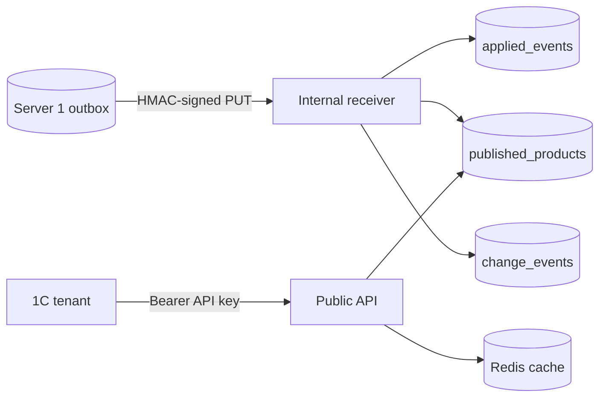

# W5 Server 2 read model և public API

W5-ը փակում է Server 1-ից հաճախորդի ընթերցում ամբողջ շղթան։ Server 2-ը ընդունում է ստորագրված product snapshot-ները, պահպանում իր առանձին PostgreSQL-ում և tenant-ներին սպասարկում է առանց Server 1-ի runtime հասանելիության։

## Publication սահմանը

`PUT /internal/v1/products/{barcode}` endpoint-ը ստուգում է HMAC-SHA256 ստորագրությունը, timestamp-ի replay window-ը և path/header/body identity-ն։ Ընդունումը մեկ PostgreSQL transaction-ում՝

1. գտնում է նույն `event_id`-ն և replay-ի դեպքում վերադարձնում է նախկին պատասխանը,
2. barcode-ի համար վերցնում է transaction-level advisory lock,
3. կիրառում է snapshot-ը միայն եթե incoming version-ը ավելի նոր է,
4. գրում է event dedup record-ը, current product-ը և append-only change event-ը,
5. commit-ից հետո invalidation է անում Redis cache-ը։

Հին version-ը ստանում է `200 ignored_stale`։ Version gap-ը նույնպես ընդունվում է, որովհետև Server 2-ին կարևոր է վերջին ճշմարիտ snapshot-ը, բայց պատասխանում նշվում է `version_gap: true`՝ ապագա alert/metric-ի համար։ Նույն version-ի այլ բովանդակությունը `409 product_version_conflict` է և չի համարվում հաջող delivery։

## Read model

`published_products`-ը typed current-state table է, ոչ թե source event-ի JSON պատճեն։ Սա database constraints-ը, ինդեքսները և public query-ները պարզ ու կանխատեսելի է պահում։ `applied_events`-ը ապահովում է event-level idempotency, իսկ `change_events`-ը W6-ի cursor feed-ի immutable հիմքն է։

Category hierarchy-ն նյութականացվում է publication-ի ժամանակ։ PostgreSQL `INSERT ... ON CONFLICT DO NOTHING`-ը նույն category-ի զուգահեռ առաջին ստեղծումները դարձնում է race-safe։

## Tenant authentication

Tenant key-ն ունի `tnt_` namespace, database lookup-ի համար ոչ գաղտնի prefix և plaintext-ի փոխարեն `scrypt` hash։ Disabled tenant-ը կամ revoked key-ը մուտք չունի։ Յուրաքանչյուր endpoint պահանջում է իր scope-ը՝ `products:read` կամ `categories:read`։

## Cache-aside ընթերցում

PostgreSQL-ը authoritative source-ն է։ Single և batch product հարցումները նախ կարդում են Redis-ից, miss-ի դեպքում՝ PostgreSQL-ից և հաջող պատասխանը պահում են 300 վայրկյան։ Redis timeout/error-ը վերածվում է cache miss/no-op-ի, այսինքն product API-ն շարունակում է աշխատել database-ից։ Նոր publication-ից հետո cache key-ն ջնջվում է միայն այն դեպքում, երբ տվյալ request-ը իրոք կիրառել է նոր version։

## Սահմաններ

- W5-ը չի հաշվում tenant quota կամ usage. դրանք W6-ի աշխատանքն են։
- Feedback և public changes endpoint-ները W6-ում են, բայց դրանց append-only հիմքը արդեն կա։
- HMAC secret rotation-ը, version-gap alert-ը և load-test threshold-ները production hardening-ի մաս են։

