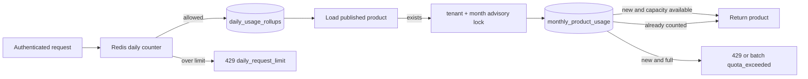

# W6 quota և usage accounting

W6-ը product delivery-ն կապում է tenant plan-ի երկու անկախ սահմանափակման հետ՝ օրական HTTP request limit և ամսական unique product quota։ Դրանք միտումնավոր տարբեր storage ու consistency կանոններ ունեն։

## Ամսական unique product

PostgreSQL-ի `monthly_product_usage` row-ն authoritative փաստն է։ Unique constraint-ը `(tenant_id, billing_month, barcode)` է։ Նոր barcode-ի check և insert-ը կատարվում են նույն transaction-ում՝ tenant+UTC billing month advisory lock-ի տակ։ Այդ պատճառով մի քանի API instance-ի զուգահեռ հարցումները չեն կարող անցնել սահմանը կամ նույն barcode-ը կրկնակի հաշվել։

Կանոնները՝

- հաշվվում է միայն գոյություն ունեցող, ոչ disabled product-ի հաջող տրամադրումը,
- նույն ամսում նույն barcode-ը կրկին չի հաշվում և հասանելի է նաև limit-ին հասնելուց հետո,
- 404, validation և server error-ը monthly quota չեն սպառում,
- batch-ը նոր barcode-երը ընդունում է input հերթականությամբ մինչև մնացած capacity-ն,
- duplicate input-ը մեկ անգամ է հաշվվում, բայց response-ի բոլոր դիրքերը պահպանվում են։

Advisory lock-ը գիտակցված MVP ընտրություն է։ Այն պարզ է և ճիշտ 100 unique/month default սահմանաչափի համար։ Մեծ batch/RPS-ի դեպքում պետք է վերանայել tenant-month counter row կամ prepaid token allocation մոտեցումը։

## Օրական request limit

Redis key-ը `rate:tenant:{tenant_id}:{UTC-date}` ձևով է և ավարտվում է հաջորդ UTC օրվա սկզբին։ Transactional Redis pipeline-ը մեկ request-ով աճեցնում է counter-ը և թարմացնում expiry-ն։ Batch-ը այստեղ մեկ HTTP request է։

Հաջող ու rate-limited փորձերը պահպանվում են `daily_usage_rollups`-ում report-ի համար։ Redis outage-ի default policy-ն fail-open է՝ public reads-ը հասանելի պահելու համար։ `RATE_LIMIT_FAIL_OPEN=false` դեպքում limiter-ի անհասանելիությունը վերադարձնում է retryable `503`, ոչ կեղծ `429`։

## Tenant plan և API

Default արժեքներն են՝ օրական 1,000 request և ամսական 100 unique barcode։ Tenant-ի `plan_config`-ը կարող է override անել `daily_request_limit` և `monthly_unique_product_limit` արժեքները։ Invalid plan value-ի դեպքում օգտագործվում է անվտանգ global default-ը։

`GET /v1/usage`-ը պահանջում է `usage:read` scope և վերադարձնում է ընթացիկ UTC օրվա request count-ը ու ամսվա unique count-ը։ Product, category և usage պատասխանները տալիս են `X-RateLimit-*` header-ներ, երբ Redis counter-ը հասանելի է։

## Սահմաններ

- Սա billing համակարգ չէ. միայն usage փաստերն ու plan limits-ն են։
- Redis fail-open պահին persistent report-ը շարունակվում է, բայց hard daily enforcement-ը ժամանակավորապես degraded է։
- Time boundary-ները MVP-ում UTC են։ Այլ billing timezone պահանջը պետք է դառնա plan-ի բացահայտ մաս։
- Feedback և changes API-ն W7-ի սահմանում են։

