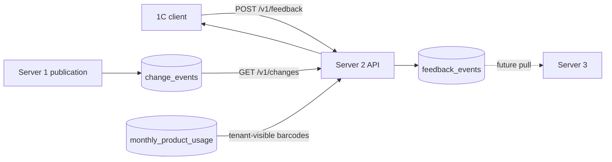

# W7 feedback և changes

W7-ը փակում է 1C client-ի երկկողմ տվյալային շրջանը․ client-ը կարող է operator-ի գնահատականը անվտանգ ուղարկել Server 2, իսկ արդեն ստացած ապրանքների նոր version-ները պարբերաբար ներբեռնել cursor-ով։

## Feedback data flow

`feedback_events`-ը `published_products`-ից առանձին append-only աղյուսակ է։ Յուրաքանչյուր row ունի մոնոտոն `sequence_id`, global `event_id`, tenant/api-key identity, client-ի idempotency key-ը, request hash-ը, product/version-ը, field-level correction-ը և երկու timestamp՝ client-ի ու server-ի։ Սա հետագայում Server 3-ին թույլ է տալիս feedback-ը pull անել հաստատուն հերթականությամբ։

Նույն `(tenant_id, idempotency_key)` զույգը unique է։ Նույն semantic payload-ի replay-ը վերադարձնում է արդեն ստեղծված `event_id`-ն, իսկ այլ payload-ը conflict է։ Insert-ը PostgreSQL `ON CONFLICT DO NOTHING`-ով է, ուստի երկու զուգահեռ նույնական request-ներն էլ մեկ event են ստեղծում։ Նոր feedback-ը ընդունվում է միայն tenant-ին նախկինում տրամադրված barcode-ի և ոչ ապագա version-ի համար։ Feedback-ը ոչ product update է, ոչ AI revalidation trigger։

## Changes data flow

Publication-ի ժամանակ W5-ից ստեղծվող immutable `change_events.change_id` identity-ն pagination-ի կարգն է։ Query-ն վերցնում է `change_id > cursor_position`, դասավորում է աճման կարգով և կարդում `limit + 1` row՝ `has_more`-ը ճշգրիտ որոշելու համար։ Վերադարձվող վերջին `change_id`-ն դառնում է հաջորդ cursor-ը։

Changes-ը tenant-scoped է. `monthly_product_usage`-ի `EXISTS` պայմանը թույլ է տալիս տեսնել միայն այն barcode-ները, որոնք տվյալ tenant-ին առնվազն մեկ անգամ տրամադրվել են։ Այդ lookup-ը նոր quota row չի ստեղծում։ `include=data` optimization-ը change-ի կողքին վերադարձնում է current `published_products` snapshot-ը, ոչ historical snapshot։

Cursor payload-ը պարունակում է schema version, tenant ID և վերջին change ID։ Այն base64url-encoded և HMAC-SHA256 signed է առանձին `CURSOR_SIGNING_SECRET`-ով։ Signature-ը պաշտպանում է դիրքի փոփոխումից, tenant binding-ը՝ client-ների միջև cursor sharing-ից։ Retention-ից հին cursor-ը վերադարձնում է `410`, որպեսզի client-ը բացահայտ full resync անի՝ լուռ տվյալ կորցնելու փոխարեն։

## Configuration

| Environment variable | Default | Նպատակ |
|---|---:|---|
| `CURSOR_SIGNING_SECRET` | development-only value | Cursor HMAC key, production-ում պարտադիր փոխել |
| `CHANGES_DEFAULT_LIMIT` | 100 | Page-ի default չափ |
| `CHANGES_MAX_LIMIT` | 1000 | Client-ի թույլատրելի առավելագույն limit |
| `CHANGES_RETENTION_DAYS` | 365 | Feed-ի նվազագույն պահպանման պատուհան |

Նոր tenant key-ի default scopes-ին ավելացվել են `feedback:write` և `changes:read`։ Երկու endpoint-ն էլ անցնում են ընդհանուր daily rate limiter-ով։

## Սահմաններ և հաջորդ քայլեր

- W7-ը feedback-ը միայն ընդունում է. reconcile/review workflow-ը MVP-ից դուրս է։
- `include=data`-ն historical snapshot չի երաշխավորում. item-ի `version`-ը փոփոխության version-ն է, `data.version`-ը՝ current-ը։
- W8-ում ավելացված է dry-run-first prefix cleanup և durable cursor floor. [resync runbook](../runbooks/changes-resync.md)։
- W8-ում optional previous signing key-ն աջակցում է controlled cursor rotation-ին. offline client grace period-ը պետք է հաստատել rollout-ից առաջ։
